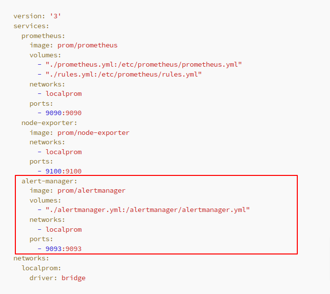
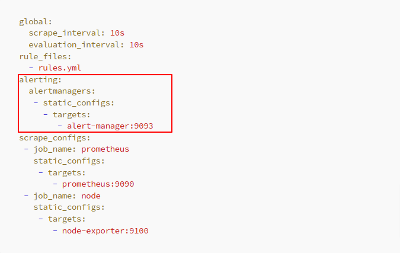
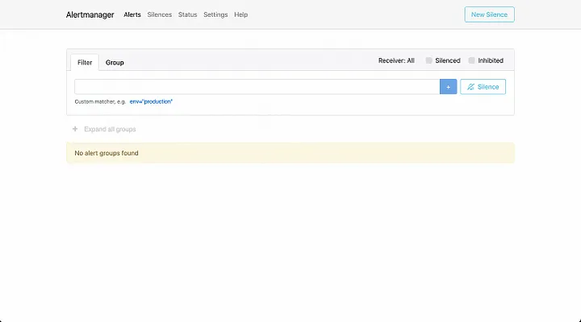

# Setup Alertmanager

For the final step, we will configure an `Alertmanager` server and set up alert rules in Prometheus that will be forwarded to Alertmanager. To do this, let’s make one last modification to our docker-compose.yaml file, including the Alertmanager container and the necessary configurations.



```yaml
alert-manager:
  image: prom/alertmanager
  volumes:
    - "./alertmanager.yml:/alertmanager/alertmanager.yml"
  networks:
    - localprom
  ports:
    - 9093:9093
```

- We have added a new `rule.yml` file to the Prometheus container, which will be responsible for configuring the alert rules using [`PromQL`](https://prometheus.io/docs/prometheus/latest/querying/basics/). For simplicity and testing purposes, we won't delve into detailed configurations.

Instead, we will set up a basic alert rule that triggers when an instance is down for at least 1 minute.

```yaml
groups:
  - name: example
    rules:
      - alert: InstanceDown
        expr: up == 0
        for: 1m
```

- We we added the alert-manager service using the [`official Alertmanager`](https://hub.docker.com/r/prom/alertmanager) image, which is bound to port 9093. This service includes an alertmanager.yml configuration file, facilitating the setup of alert notifications. For now, we won't provide specific configuration details; instead, we will configure a dummy email notification. To receive actual email notifications, you will need to set up an SMTP server and configure a valid email address as the receiver.

```yaml
global:
  smtp_smarthost: "smtp:25"
  smtp_from: "email@example.com"
route:
  receiver: example-email
  group_by: [alertname]
receivers:
  - name: example-email
    email_configs:
      - to: "email@example.com"
```

One last change you need to do is configure in your `prometheus.yml` file the Alertmanager server target, the alert rules you just defined and an evaluation interval for the alerting rules.

The final adjustment required is to configure the `Alertmanager` server target, incorporate the newly defined alert rules, and set an evaluation interval for the alerting rules in your `prometheus.yml` file.



```yaml
global:
  scrape_interval: 10s
  evaluation_interval: 10s
rule_files:
  - rules.yml
alerting:
  alertmanagers:
    - static_configs:
        - targets:
            - alert-manager:9093
scrape_configs:
  - job_name: prometheus
    static_configs:
      - targets:
          - prometheus:9090
  - job_name: node
    static_configs:
      - targets:
          - node-exporter:9100
```

Once all the changes are saved, proceed to restart your docker compose orchestration.

> docker compose up -d

You can access your newly created Alermanager server in http://localhost:9093.

